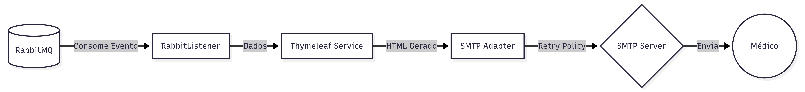

# 📨 Prioritas - Notification Service


O Notification Service é um microsserviço responsável pela comunicação assíncrona do ecossistema Prioritas. Ele atua como um Consumidor de Eventos, processando resultados de triagem e disparando alertas médicos via E-mail.

## ⚙️ Arquitetura e Responsabilidades

Este serviço foi desenhado para ser resiliente e desacoplado do core da aplicação.

- **Event-Driven:** Escuta a fila prioritas.triage.queue no RabbitMQ.
- **Templating Engine:** Utiliza Thymeleaf para gerar e-mails HTML dinâmicos e responsivos.
- **Resiliência:** Implementa Spring Retry para garantir entrega mesmo com falhas temporárias no servidor SMTP.Snippet de código



## 🛠️ Stack Tecnológica

- Linguagem: Kotlin 1.9
- Framework: Spring Boot 3.4
- JDK (Runtime): Java 17 (LTS), Toolchain configurado via `jvmToolchain(17)`
- Mensageria: Spring AMQP (RabbitMQ)
- E-mail: Spring Boot Starter Mail (JavaMailSender)
- Template: Thymeleaf
- Resiliência: Spring Retry + AOP

## 🔧 Configuração e Variáveis de Ambiente

Para que o serviço envie e-mails, é necessário configurar as credenciais SMTP. No ambiente de desenvolvimento (Docker), estas variáveis são injetadas automaticamente via docker-compose.yml.

| Variável | Descrição | Exemplo / Padrão |
| :--- | :--- | :--- |
| **RabbitMQ** | | |
| `SPRING_RABBITMQ_HOST` | Host do Broker de Mensageria | `rabbitmq` (docker) ou `localhost` |
| `SPRING_RABBITMQ_PORT` | Porta do Broker | `5672` |
| `SPRING_RABBITMQ_USERNAME` | Usuário de conexão | `guest` |
| `SPRING_RABBITMQ_PASSWORD` | Senha de conexão | `guest` |
| **E-mail (Gmail)** | | |
| `EMAIL_FROM` | Endereço de e-mail remetente (Gmail) | `seu.email@gmail.com` |
| `EMAIL_PASS` | Senha de Aplicativo (App Password) | `abcd efgh ijkl mnop` |
| `EMAIL_TARGET_LIST` | Lista de destinatários do alerta | `medico1@hospital.com,chefe@hospital.com` |

**Nota: Para utilizar o Gmail, é necessário gerar uma Senha de App nas configurações de segurança da conta Google (2-Step Verification).**

## 🚀 Como Rodar

**Via Docker Compose (Recomendado)**

A partir da raiz do projeto (prioritas-project/), execute:

```bash
docker compose up --build -d
```

## 🧪 Estrutura do Projeto

```
notification-app/
├── src/main/
│   ├── kotlin/.../
│   │   ├── application/port/in  # Listener (RabbitMQ)
│   │   ├── application/port/out # Interface de Envio
│   │   └── infra/
│   │       ├── adapter/mail     # Implementação JavaMail + Retry
│   │       └── template         # Serviço Thymeleaf
│   └── resources/
│       ├── templates/           # Arquivos .html
│       └── application.yaml     # Configurações Base
└── build.gradle.kts
```